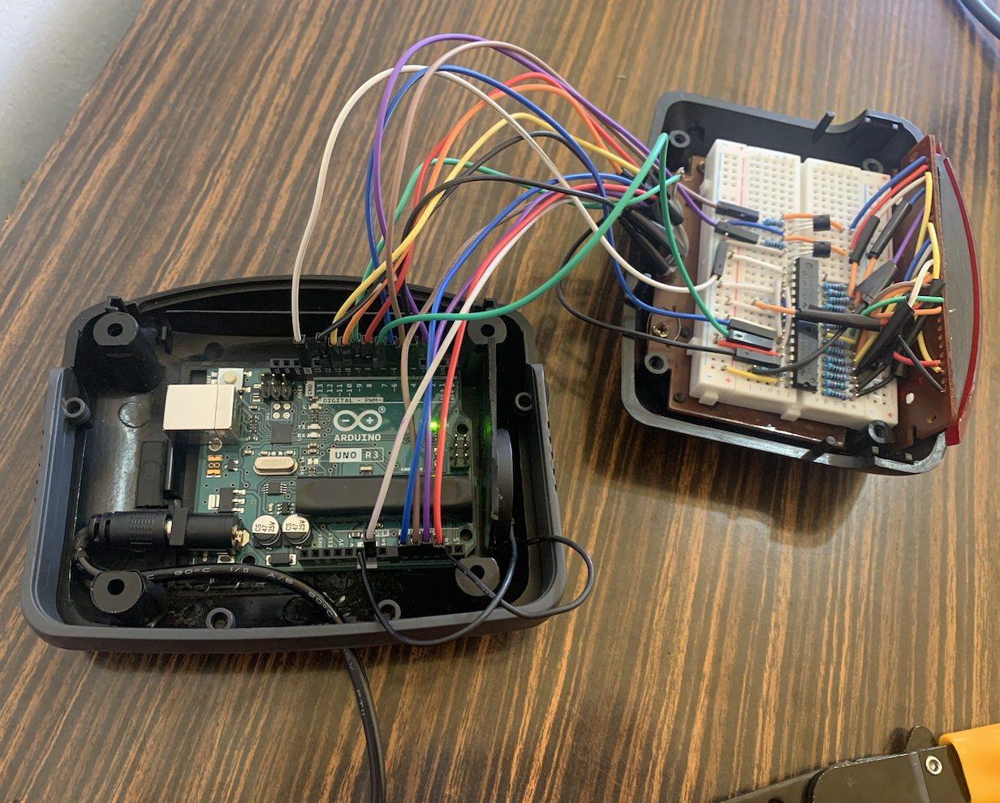
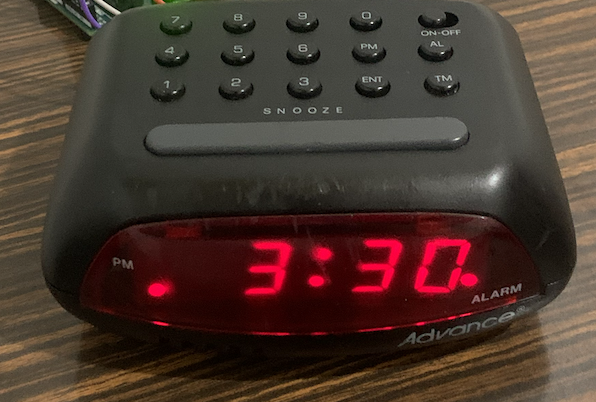
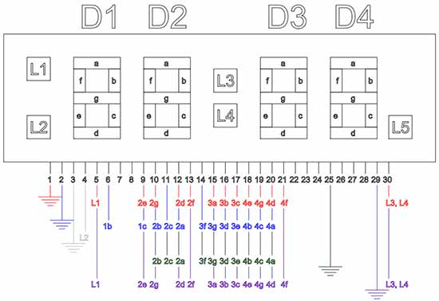
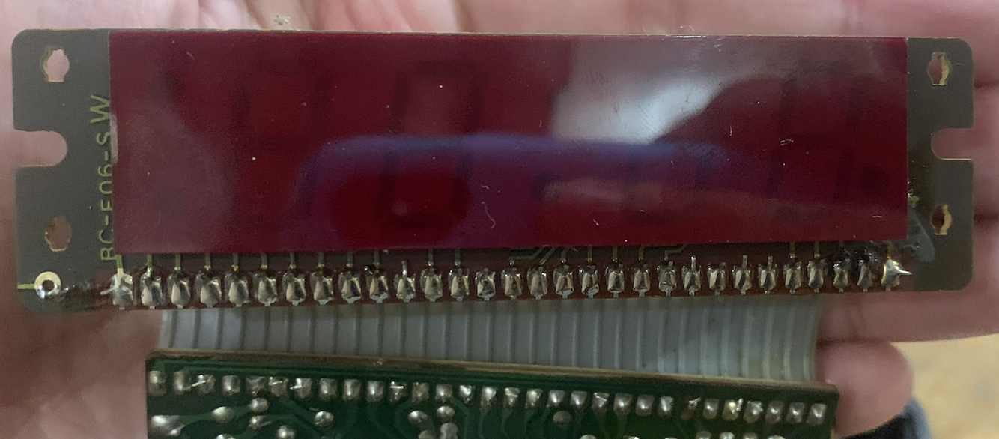
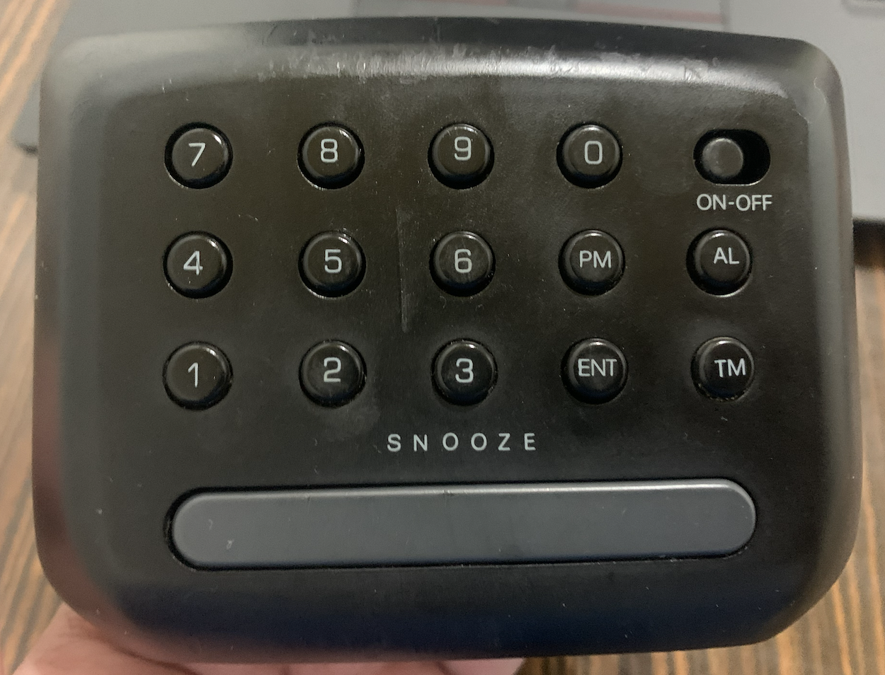
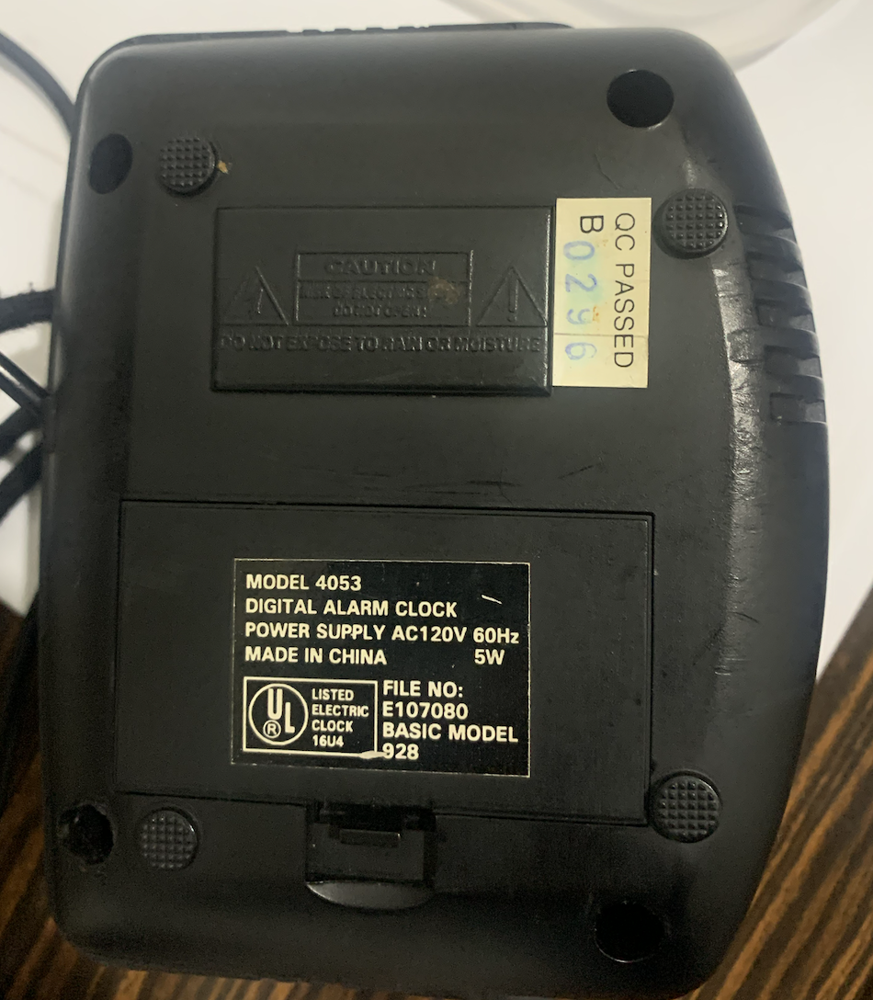

# Alarm Clock Retrofit Using Arduino UNO Board

Salvaged an older digital alarm clock with a non-working board and retrofitted it using an Arduino UNO board.

The clock didn't lose any of its functionalities. Furthermore, all of the electronic components used for this project -Arduino board included- fit inside the clock, where the factory board used to be. This means the entire project was done without altering the clock's outer shell. Therefore, it still looks the same as when it came out of the factory. Only some minor modifications were made to the device's inner shell.

## About The Clock

The device is an `Advance` brand (model `4053`) alarm clock. It features a red, LED 7 segment display; which resembles the following [schematic](https://electronics.stackexchange.com/questions/69440/alarm-clock-7-segment-led-display):

This clock also came with a 10 digit keypad as well as `AM`, `PM`, `ENT`, `TM`, `AL`, `SNOOZE` buttons and a `ON/OFF` switch.

It came from factory with an `AC120V`, `60hz`, `5w` power supply. Apparently, it could either be powered via a `9v` battery (rectangular battery), or through an electrical outlet, since it had both a battery slot and an `Type A` electrical plug.

No further information was found about the clock itself on the internet.

## Notes

Although I developed this project on december 2025, I didn't make a GitHub repository for it until july 2026. Commit dates are adjusted to reflect the actual day in which a certain feature was implemented. Code may have some minor typos, indentation may be inconsistent.

## Relevant Sources

- [Arduino Clock Using Standard Clock Display | ntewinkel](https://www.instructables.com/Arduino-Clock-using-Standard-Clock-Display/) This source initially served as a general guide on how to proceed.

- [Alarm Clock 7 Segment LED display | Adam Dally](https://electronics.stackexchange.com/questions/69440/alarm-clock-7-segment-led-display) This source provides a schematic for a 7 Segment LED display that's quite similar to the one I used, if not the same, as well as an explanation on the way it works.
